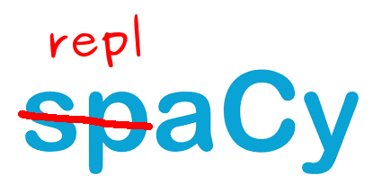
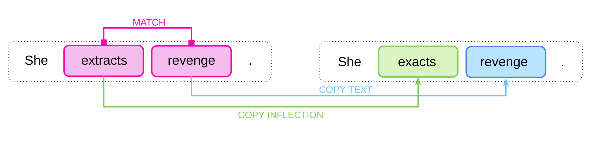

<p align="center">

</p>

# replaCy: match & replace with spaCy

We found that in multiple projects we had duplicate code for using spaCy’s blazing fast matcher to do the same thing: Match-Replace-Grammaticalize. So we wrote replaCy!

- Match - spaCy’s matcher is great, and lets you match on text, shape, POS, dependency parse, and other features. We extended this with “match hooks”, predicates that get used in the callback function to further refine a match.
- Replace - Not built into spaCy’s matcher syntax, but easily added. You often want to replace a matched word with some other term.
- Grammaticalize - If you match on ”LEMMA”: “dance”, and replace with suggestions: ["sing"], but the actual match is danced, you need to conjugate “sing” appropriately. This is the “killer feature” of replaCy

[](https://spacy.io)
[](https://pypi.org/project/replacy/)
[](https://github.com/ambv/black)

<p align="center">

</p>


## Requirements

- `spacy >= 2.0` (not installed by default, but replaCy needs to be instantiated with an `nlp` object)

## Installation

`pip install replacy`

## Quick start

```python
from replacy import ReplaceMatcher
from replacy.db import load_json
import spacy


match_dict = load_json('/path/to/your/match/dict.json')
# load nlp spacy model of your choice
nlp = spacy.load("en_core_web_sm")

rmatcher = ReplaceMatcher(nlp, match_dict=match_dict)

# get inflected suggestions
# look up the first suggestion
span = rmatcher("She extracts revenge.")[0]
span._.suggestions
# >>> ['exacts']
```

## Input

ReplaceMatcher accepts both text and spaCy doc.

```python
# text is ok
span = r_matcher("She extracts revenge.")[0]

# doc is ok too
doc = nlp("She extracts revenge.")
span = r_matcher(doc)[0]
```

## Inflection library

ReplaCy uses [LemmInflect](https://github.com/bjascob/LemmInflect) inflection module underhood.

Speed and accuracy benchmark (copied from the Lemminflect repo):

```sh
| Package          | Verb  |  Noun | ADJ/ADV | Overall |  Speed  |
|----------------------------------------------------------------|
| LemmInflect      | 96.1% | 95.4% |  93.9%  |  95.6%  | 42.0 uS |
| CLiPS/pattern.en | 93.6% | 91.1% |   0.0%  |  n/a    |  3.0 uS |
| Stanford CoreNLP | 87.6% | 93.1% |   0.0%  |  n/a    |  n/a    |
| spaCy            | 79.4% | 88.9% |  60.5%  |  84.7%  |  5.0 uS |
| NLTK             | 53.3% | 52.2% |  53.3%  |  52.6%  | 13.0 uS |
|----------------------------------------------------------------|
```

## match_dict.json format

Here is a minimal `match_dict.json`:

```json
{
  "extract-revenge": {
    "patterns": [
      {
        "LEMMA": "extract",
        "TEMPLATE_ID": 1
      }
    ],
    "suggestions": [
      [
        {
          "TEXT": "exact",
          "FROM_TEMPLATE_ID": 1
        }
      ]
    ],
    "match_hook": [
      {
        "name": "succeeded_by_phrase",
        "args": "revenge",
        "match_if_predicate_is": true
      }
    ],
    "test": {
      "positive": [
        "And at the same time extract revenge on those he so despises?",
        "Watch as Tampa Bay extracts revenge against his former Los Angeles Rams team."
      ],
      "negative": ["Mother flavours her custards with lemon extract."]
    }
  }
}
```
For more information how to compose `match_dict` see our [wiki](https://github.com/Qordobacode/replaCy/wiki/match_dict.json-format): 


# Citing

If you use replaCy in your research, please cite with the following BibText

```bibtext
@misc{havens2019replacy,
    title  = {SpaCy match and replace, maintaining conjugation},
    author = {Sam Havens and Aneta Stal},
    url    = {https://github.com/Qordobacode/replaCy},
    year   = {2019}
}
